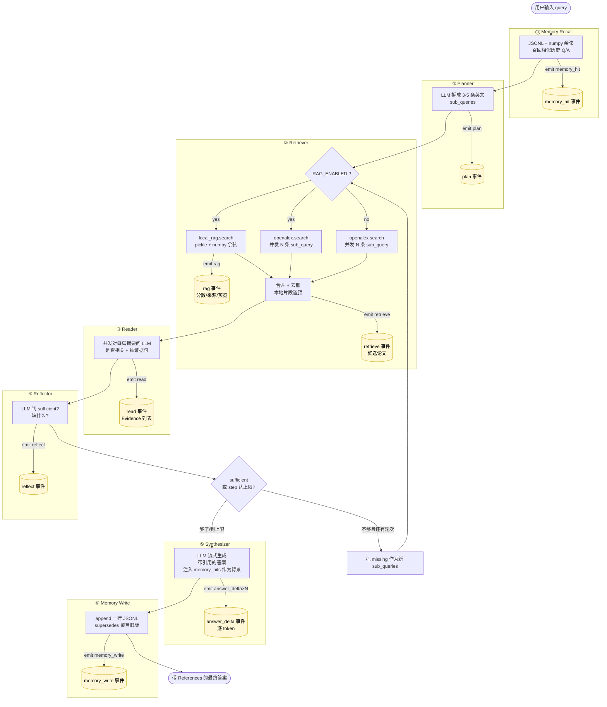

# Agent Search — 学术论文搜索 Agent (MVP 骨架)

一个面向学术场景的 Agent Search 最小可运行骨架：
- **后端**：FastAPI + LangGraph，调用 OpenAlex 检索论文、用 LLM 综合答案、SSE 流式返回
- **前端**：Next.js 14 + Tailwind，搜索框 → 流式展示 Agent 的每一步（Planner / Retriever / Synthesizer）+ 论文卡片
- **LLM**：默认走 OpenAI 兼容 API（可指向 DeepSeek / 自托管 vLLM / OpenAI），通过环境变量切换

## 流程总览

`Memory Recall → Planner → Retriever (RAG + OpenAlex) → Reader → Reflector`，不够就回跳再搜一轮；够了或触达 `AGENT_MAX_STEPS` 走 Synthesizer 流式出答案，最后 Memory Write 把本轮 Q/A 追加到 JSONL。



| 阶段 | LLM 调用 | 并发 | 代码 |
|---|---|---|---|
| Memory Recall | 0（1 次 embedding） | — | `nodes.py::memory_recall_node` |
| Planner | 1 | — | `nodes.py::planner_node` |
| Retriever | 0 | `sub_queries` 数 + 本地 RAG 并发 | `nodes.py::retriever_node` |
| Reader | N（候选数） | N 并发 | `nodes.py::reader_node` |
| Reflector | 1 | — | `nodes.py::reflector_node` |
| Synthesizer | 1（流式） | — | `nodes.py::synthesizer_node` |
| Memory Write | 0（1 次 embedding） | — | `nodes.py::memory_write_node` |
| 回跳条件 | — | `not sufficient and step < MAX_STEPS` | `agent/graph.py::route_after_reflect` |

单轮无反思 ≈ `N + 3` 次 LLM；反思一次再加 `N + 1`；默认 `AGENT_MAX_STEPS=4`。

## 快速开始

### 1. 准备 LLM 凭据
复制 `.env.example` → `.env`，填入：
```
LLM_BASE_URL=https://api.deepseek.com/v1       # 或 http://vllm:8000/v1  或  https://api.openai.com/v1
LLM_API_KEY=sk-xxx
LLM_MODEL=deepseek-chat                        # 或 Qwen/Qwen2.5-72B-Instruct-AWQ / gpt-4o-mini
```

### 2. 启动
```bash
docker compose up --build
```

- 后端：http://localhost:8000 （docs 在 `/docs`）
- 前端：http://localhost:3000

### 3. 本地开发（不走 docker）
```bash
# 后端
cd apps/api
uv sync   # 或 pip install -e .
uvicorn app.main:app --reload --port 8000

# 前端
cd apps/web
pnpm install
pnpm dev
```

## 目录
```
apps/
  api/          FastAPI + LangGraph
  web/          Next.js 14 前端
scripts/        开发脚本
docker-compose.yml
```

## 本地 RAG（可选，最小版）

在 OpenAlex 旁边加一条"本地文档检索"支路，让 Agent 同时能搜你自己的笔记 / PDF / markdown：

```bash
# 1. 把文档丢进 docs/ （支持 md / txt，加 --pdf 也能吃 PDF）
mkdir docs && cp ~/notes/*.md docs/

# 2. 建索引（写出 rag_index.pkl）
python scripts/build_index.py ./docs

# 3. 打开 RAG
export RAG_ENABLED=true

# 4. 选嵌入后端：
#  (A) 走 API：OpenAI / Ark embedding endpoint / vLLM 起的 bge-m3
export EMBED_BACKEND=api
export LLM_EMBED_MODEL=text-embedding-3-small   # 或 Ark 的 ep-xxx
#  (B) 本地 sentence-transformers（零外部调用，首次会下权重到 ~/.cache/huggingface/）
pip install sentence-transformers
export EMBED_BACKEND=local
export EMBED_LOCAL_MODEL=BAAI/bge-small-zh-v1.5   # 中英双语 ~100MB

# 5. 跑 demo；Retriever 会把本地片段和 OpenAlex 结果混进同一个候选池
python demo.py "..."
```

跑起来会看到一个独立的 RAG 分区，和 OpenAlex 的候选列表分开展示：

```
▌ Planner — 拆分为学术检索词
  1. few-shot object detection meta-learning
  ...

▌ RAG — 本地文档检索
  1. score=0.782  /path/to/notes/meta-rcnn.md
     Meta R-CNN introduces a class-attentive vector to re-weight ROI features ...
  2. score=0.691  /path/to/notes/fsod-survey.md
     ...

▌ Retriever — OpenAlex 检索结果
  - [Local] [?] (? cites) /path/to/notes/meta-rcnn.md
  - [2023] (142 cites) Meta R-CNN: Towards General Solver for ...
  ...
```

> **DeepSeek 用户注意**：DeepSeek 不提供 embeddings API。把 `EMBED_BACKEND=local` 最省事。

> **Ark/豆包 用户注意**：chat 和 embedding 需要**两个独立的 endpoint**（在控制台创建 embedding 类型 endpoint），填在 `LLM_EMBED_MODEL`。不想开就切 local。

> **切换后端必须重建索引**：api 和 local 的嵌入维度不同（典型 1536 vs 512），旧 pickle shape 对不上会静默降级成空命中。重跑 `python scripts/build_index.py ./docs` 就行。

实现细节：`pickle + numpy` 点积余弦，无额外服务和依赖。建索引时片段被 L2 归一化，运行时 query 编码后直接 `vectors @ qv` 取 top-k。NaN/Inf 在建库和加载两处都会被 `np.nan_to_num` 清洗，避免 matmul 触发 `RuntimeWarning`。见 [`apps/api/app/retrieval/local_rag.py`](apps/api/app/retrieval/local_rag.py) 和 [`scripts/build_index.py`](scripts/build_index.py)。

## 记忆（可选，跨问题历史召回 + 同问题自动更新）

在 Agent 最前面加一次 `memory_recall`，最末端加一次 `memory_write`，实现跨 session 的"你之前问过什么、我答过什么"的 episodic 记忆。默认 `MEMORY_MODE=off`，不开时整条链路完全不碰磁盘。

### 存储：JSONL，一行一条 episode

```json
{"id":"ep_abc","ts":1730000000.0,"query":"元学习小样本检测","answer":"...","paper_ids":["W1","local::..."],"embed_backend":"local","embed_model":"BAAI/bge-small-zh-v1.5","embedding":[512 floats]}
{"id":"ep_xyz","ts":1735000000.0,"query":"元学习小样本检测进展","answer":"...v2","paper_ids":[...],"embed_backend":"local","embed_model":"BAAI/bge-small-zh-v1.5","embedding":[...],"supersedes":"ep_abc"}
```

- **append-only**：从不改写已有行，崩了最多丢最后一行；`tail -f ~/.agent-search/memory.jsonl` 能肉眼看历史。
- **"更新"就是写一行新的 + `supersedes` 指向旧的**：recall 加载时 `superseded_ids = {e.supersedes for e in all}`，这批 id 直接过滤掉，只剩"当前版"。旧行永远保留在文件里，审计 / 回滚友好。
- **Backend tag**：`embed_backend` / `embed_model` 字段兜底 —— 切了嵌入后端（比如从 api 换到 local）维度不同，旧行自动被 recall 忽略但不删，下次切回去还能用。
- **规模上限**：10k 条 × 512 维 ≈ 20MB，内存加载 + numpy 点积够用。超了再上 sqlite-vec，不是 MVP 问题。

### 写入决策树（Synthesizer 跑完后）

```
对新 query 算 embedding
  → 和现有 active episode 算 cosine，取 top-1
    if score > MEMORY_UPDATE_THR (0.92):
      policy=supersede (默认)  → 新行 supersedes=旧行.id
      policy=append            → 新老都保留
      policy=skip              → 不写
    else:
      append 新行（无 supersedes）
```

### 两种"强制刷新"入口

1. **CLI**：`python demo.py --memory-refresh "..."` 本次跳过 recall（synthesizer 不注入历史），但跑完还是会写一条，根据 `MEMORY_UPDATE_POLICY` 触发 supersede。交互模式下用 `!refresh <query>`。
2. **TTL**：`MEMORY_MAX_AGE_DAYS=30`（默认 0=关闭）超龄的 episode 不参与 recall。

### 开起来

```bash
# 打开记忆
export MEMORY_MODE=recall
# 记忆用的是 EMBED_BACKEND，和 RAG 共用 —— 不开 RAG 也能用记忆
export EMBED_BACKEND=local
export EMBED_LOCAL_MODEL=BAAI/bge-small-zh-v1.5

# 连跑两次同一个问题，第二次会命中记忆 + 按 supersede 覆盖旧记忆
python demo.py "元学习小样本目标检测进展"
python demo.py "元学习小样本目标检测进展"

# 想刷新：不走缓存，但跑完仍会写新记录覆盖老的
python demo.py --memory-refresh "元学习小样本目标检测进展"

# 关掉记忆（回到原本的行为）
unset MEMORY_MODE
```

CLI 会多出两个分区：

```
▌ Memory — 相关历史问答
  1. score=0.953  2025-10-20 22:31
     Q: 元学习小样本目标检测
     A: 元学习在小样本检测中主要有两条路线：基于 re-weighting 的 Meta R-CNN ...

▌ Memory — 写入新记忆
  id=ep_41789c747311 supersedes=ep_2cac65d0f898  refs=6
```

Synthesizer 会把 `memory_hits` 作为"相关历史问答"塞进 prompt 的独立区块里，并在 system prompt 里明确"只当背景、不作正文引用"，避免被老答案带偏。

### 配置一览（见 `.env.example`）

| 环境变量 | 默认 | 作用 |
|---|---|---|
| `MEMORY_MODE` | `off` | `off` / `recall`（读 + 写） |
| `MEMORY_PATH` | `~/.agent-search/memory.jsonl` | JSONL 存储路径（`~` 会展开） |
| `MEMORY_RECALL_K` | `3` | recall 返回 top-K |
| `MEMORY_RECALL_THR` | `0.75` | 低于这个分数的历史不注入 |
| `MEMORY_UPDATE_THR` | `0.92` | 超过此分视为"同一问题"，按 policy 更新 |
| `MEMORY_UPDATE_POLICY` | `supersede` | `supersede` / `append` / `skip` |
| `MEMORY_MAX_AGE_DAYS` | `0`（关） | 超龄的 episode 不参与 recall |

实现细节：[`apps/api/app/memory.py`](apps/api/app/memory.py) ~200 行；接入点 [`apps/api/app/agent/nodes.py::memory_recall_node / memory_write_node`](apps/api/app/agent/nodes.py) 和 [`agent/graph.py`](apps/api/app/agent/graph.py)（`START → memory_recall → planner → ... → synthesizer → memory_write → END`）。

### 为什么不做 cache 模式（直接返老答案）

目前只做 `off` 和 `recall`。"相似度超阈值跳过整条 Agent 直接返历史"的 cache 短路很诱人，但在 MVP 阶段容易让人把"问过一次"当"正确答案永远不变"，尤其是论文领域时效性强。等评估链路（RAGAS / 人工抽查）上来以后再加。

## CLI 事件一览

每个阶段都会 `emit(event_type, payload)`，CLI（`demo.py`）按类型分支渲染，未来接 SSE 前端也走一样的协议：

| event_type | 时机 | payload 关键字段 |
|---|---|---|
| `memory_hit` | `memory_recall` 跑完（含 refresh / error / 无命中） | `enabled, refreshed?, error?, hits[{id, score, ts, query, answer_preview}]` |
| `plan` | Planner 出 sub_queries 后 | `sub_queries: list[str]` |
| `rag` | Retriever 启用 RAG 时（含索引不可用 / 异常分支） | `enabled, available, hits[{score,source,preview}], error?` |
| `retrieve` | Retriever 合并去重粗排后 | `queries, papers[...]`（包含 `source="local"` 标记） |
| `read` | Reader 完成一轮 | `evidences[{paper_id, claim, snippet}]` |
| `reflect` | Reflector 完成一轮 | `sufficient: bool, missing: list[str]` |
| `answer_delta` | Synthesizer 流式输出每个 token | `delta: str` |
| `memory_write` | `memory_write` 跑完 | `written: bool, id?, ts?, supersedes?, paper_count?, reason?/error?` |
| `error` | 任意节点 catch 到异常 | `message: str` |

## 下一步扩展
- 接入 Semantic Scholar / arXiv / Unpaywall
- 加入 Qdrant + bge-m3 做语义检索与 Rerank
- GROBID/MinerU 解析 PDF，做单篇追问
- Langfuse 接入做可观测性
- 评估集 + RAGAS 回归
